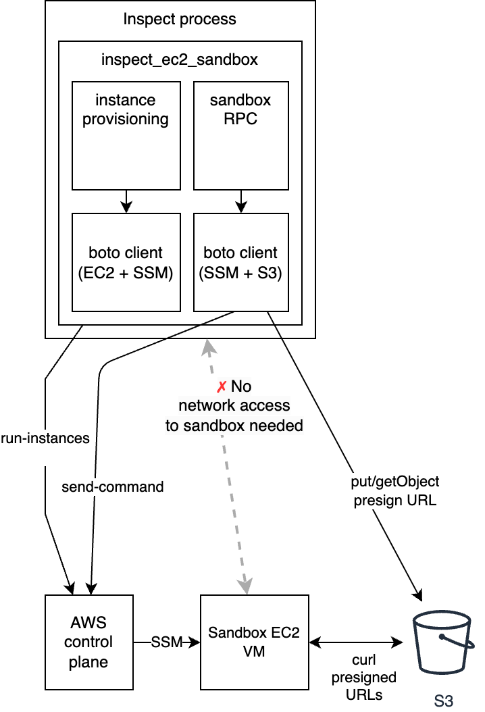

# Contributing Guide

**NOTE:** If you have any feature requests or suggestions, we'd love to hear about them
and discuss them with you before you raise a PR. Please come discuss your ideas with us
in our [Inspect
Community](https://join.slack.com/t/inspectcommunity/shared_invite/zt-2w9eaeusj-4Hu~IBHx2aORsKz~njuz4g)
Slack workspace.

## Getting started

This project uses [uv](https://github.com/astral-sh/uv) for Python packaging.

Run this beforehand:

```
uv sync
```

You then can either source the venv with

```
source .venv/bin/activate
```

or prefix your pytest (etc.) commands with `uv run ...`

## Architecture

The diagram below shows the high-level architecture of `inspect_ec2_sandbox` and how
it interacts with AWS. The package runs in-process inside Inspect and is split into
two main responsibilities:

- **Instance provisioning** (`_instance_provider.py`) — uses the EC2 API (`run_instances`)
  to create sandbox VMs, and SSM (`describe_instance_information`) to wait for the SSM
  agent to come online.
- **Sandbox RPC** (`_ec2_sandbox_environment.py`) — implements Inspect's `SandboxEnvironment`
  interface (`exec`, `read_file`, `write_file`). Commands are dispatched via SSM
  `send_command` with stdout/stderr written to S3; file transfers happen via S3 presigned
  URLs that the sandbox VM fetches with `curl`.

The Inspect host never opens a network connection to the sandbox VM directly: all control
flows through the AWS control plane (EC2 + SSM) and all data flows through S3.



## Tests

Run the tests with `uv run pytest`.

For most of the tests you will need AWS credentials to be available to the boto
python library.

## Linting & Formatting

[Ruff](https://docs.astral.sh/ruff/) is used for linting and formatting. To run both
checks manually:

```bash
uv run ruff check .
uv run ruff format .
```

## Type Checking

[Mypy](https://github.com/python/mypy) is used for type checking. To run type checks
manually:

```bash
mypy
```
